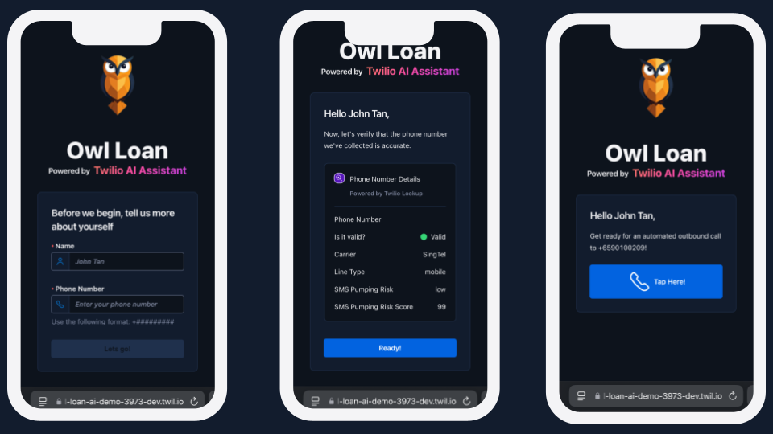

# Twilio Owl Loan AI Demo

[](https://github.com/leroychan/twilio-flex-conversations-adapters/blob/master/LICENSE.md)

The **Twilio Owl Loan AI Demo** is an interactive application designed to showcase the power of Twilio’s AI-driven capabilities. This demo highlights how Twilio products seamlessly integrate to build a complete AI outbound calling solution, providing a hands-on experience for users.

Live Example: [Link](https://twilio-owl-loan-ai-demo-3973-dev.twil.io/index.html)



## Key Demo Features

- **AI-Driven Outbound Calls** – Powered by **Twilio Assistant with AI Perception Engine** for automated customer interactions.
- **Real-Time Transcription** – Live call transcription displayed via **Twilio Voice Intelligence**.
- **Secure Payments** – PCI-compliant payment processing through **Twilio Pay** with **Stripe payment gateway**.
- **Phone Number Intelligence** – Validate and analyze numbers using **Twilio Lookup** to detect fraud and improve accuracy.
- **AI-Generated Summary & Sentiment Analysis** – Automated insights provided by **Twilio Voice Intelligence**.
- **WhatsApp Notifications** – Send **payment confirmations** and **call summaries** via **Twilio Programmable Messaging**.

## Deploy

**Pre-Requisites**:

- Twilio CLI (v5.22.9 and above)
- Node.js (v18 and above)
- Twilio Account with PCI Mode Enabled (_Guide: [Link](https://www.twilio.com/docs/voice/tutorials/how-capture-your-first-payment-using-pay#1-enable-pci-mode)_)
- Set Up Twilio Pay with Stripe (_Guide: [Link](https://www.twilio.com/docs/voice/tutorials/how-capture-your-first-payment-using-pay)_)
- Setup WhatsApp Sender in Twilio (\_Guide: [Link](https://www.twilio.com/docs/whatsapp/self-sign-up))
- Set up and get approval for 2 WhatsApp Templates (Payment Confirmation & Call Summary) via Twilio Content Template Builder (_Guide: [Link](https://www.twilio.com/docs/content/create-templates-with-the-content-template-builder)_)
- Segment Account with Unify enabled

### Step 1: Clone Project

```
git clone https://github.com/leroychan/twilio-owl-loan-ai-demo.git
```

### Step 2: Build `client-ui`

```
cd client-ui
npm run build
```

### Step 3: Set Up `serverless-functions` Environment Variables

```
cd .. && cd serverless-functions
cp .env.example .env
```

Edit all the environment variables within the file

### Step 4: Build `serverless-functions`

```
npm run build
```

### Step 5: Deploy to Twilio Functions

```
twilio serverless deploy -p <<twilio cli profile>>
```
